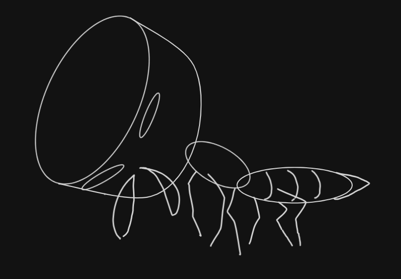

# Cephalote



Cephalote scans a source tree for weak and broken cryptography (MD5, DES, RC4,
undersized RSA keys, hardcoded keys, and so on) and tells you where it found
them. It's a single static binary with no runtime dependencies, meant to drop
onto a server or into CI without fuss.

## Install

### Arch Linux (AUR)

Cephalote is packaged on the AUR as [`cephalote`](https://aur.archlinux.org/packages/cephalote),
built from source against the tagged release. With an AUR helper:

```sh
yay -S cephalote      # or: paru -S cephalote
```

Or manually, with `makepkg`:

```sh
git clone https://aur.archlinux.org/cephalote.git
cd cephalote
makepkg -si
```

The AUR package ships the **Tree-sitter** profile. The zero-cgo default exists
so a single binary can be dropped onto a machine with no toolchain; a package
that compiles on your own machine has no such constraint, so it takes the tier
that detects more (see [Build profiles](#build-profiles-tree-sitter)). It
installs the binary to `/usr/bin/cephalote`, shell completions for bash, zsh,
and fish, and the annotated config plus scheduling guide under
`/usr/share/doc/cephalote/`.

To build the package straight from this repo instead of the AUR, run
`makepkg -si` in the repo root; the [`PKGBUILD`](./PKGBUILD) here is the same
one that's published.

### Other platforms

```sh
# Go toolchain
go install github.com/Smiduweorc/Cephalote/cmd/cephalote@latest

# Released binary (Linux/macOS, amd64/arm64)
curl -sSfL https://raw.githubusercontent.com/Smiduweorc/Cephalote/master/install.sh | sh

# Container (scratch image, ~static binary)
docker run --rm -v "$PWD:/src:ro" ghcr.io/smiduweorc/cephalote scan /src
```

`.deb`/`.rpm` packages and checksummed archives are attached to each
[GitHub Release](https://github.com/Smiduweorc/Cephalote/releases). Or build
locally with `make build` (static, zero-cgo).

All of the above - `go install`, the released binaries, and the container -
ship the **default** zero-cgo profile, which has no Tree-sitter analyzer: the
thirteen tier-2 languages fall back to the low-confidence regex scan there. For
high-confidence analysis of those languages, install from the AUR or build the
Tree-sitter profile yourself (see [Build profiles](#build-profiles-tree-sitter)).

To run Cephalote continuously (on an interval or as a managed daemon) see
[docs/SCHEDULING.md](docs/SCHEDULING.md) for copy-pasteable Docker, Compose,
Kubernetes `CronJob`, and systemd examples.

## Usage

```sh
cephalote scan <dir> [flags]

  --format {text|json|sarif}   output format (default: text)
  --exit-code                  exit non-zero (1) when findings are present (CI gate)
  --include-unknown            run the regex fallback on unrecognized languages
  --min-confidence {low|high}  minimum confidence to report (default: low)
  --scheme <names|classes>     search for specific algorithms (see below)
  --config <file>              YAML config: excludes, overrides, custom schemes

cephalote schemes              list the algorithm catalog
```

Examples:

```sh
# Human-readable scan of the current tree
cephalote scan .

# SARIF for GitHub/GitLab code scanning, only high-confidence findings
cephalote scan . --format sarif --min-confidence high > results.sarif

# Gate a CI pipeline on any findings
cephalote scan . --exit-code
```

### Searching for specific algorithms

Beyond the default weak-crypto scan, `--scheme` turns Cephalote into a
crypto-aware search, useful for inventory and migration (e.g. "where do we
still use SHA-256?"). It accepts canonical names, aliases, or class selectors,
and reports matches of *any* strength, tagged with their security class.

```sh
cephalote schemes                          # list every known algorithm + class
cephalote scan . --scheme sha256           # find a specific algorithm
cephalote scan . --scheme sha-256,des3     # aliases + multiple, comma-separated
cephalote scan . --scheme weak             # all broken+weak schemes (broad net)
cephalote scan . --scheme all              # full crypto inventory
```

Class selectors: `all`, `weak` (broken+weak), `broken`, `legacy`, `contextual`,
`strong`. Search matches are regex-based and therefore low confidence.

## How it works

Cephalote detects the language of each file, then hands it to the most precise
analyzer it has for that language:

| Analyzer | Languages | Availability | Confidence |
|----------|-----------|--------------|------------|
| Go `go/ast` | Go | built-in | `high` |
| Tree-sitter | Python, JavaScript, TypeScript, Java, Kotlin, Scala, C#, Ruby, PHP, Rust, Swift, C, C++ | `treesitter` build | `high` |
| Regex over the scheme catalog | everything else | built-in | `low` |

The Go analyzer reads the actual syntax tree, so it is import-aware and looks at
values and structure: it flags `rsa.GenerateKey(rand.Reader, 1024)` but not
`4096`, follows renamed imports, and spots hardcoded keys and static or zero
IVs. The regex analyzer scans every other language line by line against the
[algorithm catalog](internal/scheme/scheme.go), which is why those matches are
reported at low confidence.

The Tree-sitter analyzer works the same way across all thirteen languages. It
reads dotted names out of the tree, so one entry covers every way a name can be
qualified (`DES.new` matches `Crypto.Cipher.DES.new`), and it reads the
arguments, so it separates the real problem from the lookalike:
`Cipher.getInstance("DES/ECB/PKCS5Padding")` reports both DES and ECB while
`"AES/GCM/NoPadding"` reports nothing, and `Signature.getInstance("SHA1withRSA")`
is flagged where `"PBKDF2WithHmacSHA1"` is not. Key sizes are read as values, so
`new RSACryptoServiceProvider(1024)` is flagged and `4096` is not. Detections
that would be wrong for a given ecosystem are deliberately absent: Rust's
`rand::random` and Swift's `arc4random` are CSPRNG-backed, so neither is
reported as insecure randomness.

### Build profiles (Tree-sitter)

Tree-sitter grammars require cgo, which pulls against the goal of shipping a
single static `CGO_ENABLED=0` binary. There are two build profiles to cover
both cases:

- **Default** (`make build`, `go install`): pure-Go, fully static. There is no
  Tree-sitter analyzer, so Python, JavaScript, and the rest fall back to the
  regex scan.
- **Tree-sitter** (`make build-treesitter`, i.e. `CGO_ENABLED=1 go build -tags
  treesitter`): adds real AST analysis at high confidence for all thirteen
  languages in the table above, at the cost of cgo.

```sh
# High-confidence analysis for every Tree-sitter language
CGO_ENABLED=1 go build -tags treesitter -o cephalote-ts ./cmd/cephalote
```

A language is supported exactly when it appears in the registry in
[`internal/engine/ts/lang_specs.go`](internal/engine/ts/lang_specs.go). The
analyzer itself is language-agnostic, so adding one is a table entry: the
grammar, the handful of node types it uses for names and calls, and the
detections.

### Configuration & suppression

A YAML config (`--config`) adds excludes, rule overrides, and project-specific
detections, see [`cephalote.example.yaml`](cephalote.example.yaml):

```yaml
exclude: ["testdata/**", "**/*.min.js"]
rules:
  disable: [weak-hash-sha1, "scheme:cbc"]
  severity: { insecure-random: low }
custom_schemes:
  - id: internal-xor
    class: broken
    pattern: "(?i)\\bxor_encrypt\\b"
    remediation: "Use a vetted AEAD cipher."
```

Individual findings can be silenced inline (any language) with a comment:

```go
h := md5.New() // cephalote:ignore weak-hash-md5
secret := sha1.Sum(x) // cephalote:ignore       (bare form silences the line)
```

### Detections

**Go** (tier 1, high confidence, built in): weak hashes (MD5, SHA-1, MD4),
weak/broken ciphers (DES, 3DES, RC4, Blowfish), undersized RSA keys (<2048),
insecure randomness (`math/rand`), deprecated TLS versions, hardcoded keys, and
static/zero IVs.

**The thirteen Tree-sitter languages** (tier 2, high confidence, `treesitter`
build): weak hashes, weak/broken ciphers, ECB mode, undersized RSA keys,
insecure randomness, and deprecated TLS/SSL versions - read from the syntax
tree through each ecosystem's own API, so the same rule catches Java's
`Cipher.getInstance("DES/ECB/PKCS5Padding")`, Node's
`crypto.createCipheriv('des-ede3-cbc', ...)`, Ruby's `OpenSSL::Cipher.new`,
.NET's `new DESCryptoServiceProvider()`, PHP's `openssl_encrypt`, and
OpenSSL's `EVP_des_ede3_cbc()`. Hardcoded keys and static IVs are Go-only for
now.

**Every other language** (tier 3, low confidence): the full
[scheme catalog](internal/scheme/scheme.go): 50+ algorithms spanning hashes,
ciphers, modes, asymmetric schemes, KDFs, RNGs, and TLS versions. Run
`cephalote schemes` to list them.

## Exit codes

| Code | Meaning |
|------|---------|
| 0 | Success (no findings, or findings without `--exit-code`) |
| 1 | `--exit-code` set and findings were present |
| 2 | Operational error (bad flag, unreadable path, etc.) |

## Development

```sh
make build             # static, zero-cgo binary
make build-treesitter  # cgo binary with the Tree-sitter analyzer
make test              # race + coverage (default profile)
make test-all          # both profiles
make fmt vet           # formatting + go vet
make snapshot          # local goreleaser build (no publish)
make help              # list all targets
```

### Tests

Run `make test-all`, not just `make test`: the two build profiles compile
different code. The default profile builds the Tree-sitter *stub*, so
`make test` never exercises the tier-2 analyzer at all, and the routing tests
assert different confidences in each profile.

Every package has tests. Beyond the per-package unit tests, a few are worth
knowing about because they are what keeps the moving parts honest:

- **Language fixtures** (`internal/engine/ts`): each of the thirteen languages
  has a weak fixture asserting exact per-rule counts *and* a clean fixture that
  must produce **zero** findings. The clean half is the important one - a
  crypto scanner that cries wolf on `AES/GCM/NoPadding` gets switched off.
- **Registry invariants**: every entry in the detection tables must name a rule
  the catalog knows (otherwise it panics at scan time rather than test time),
  and every language routed to tier 2 by `internal/lang` must be registered in
  the analyzer, so detection and routing cannot drift apart.
- **Output contracts** (`internal/report`): SARIF is machine-consumed, so the
  tests pin the things that break ingest silently - empty arrays that must not
  serialize as `null`, and every result referencing a declared rule.
- **Exit codes** (`cmd/cephalote`): run as a subprocess, since `--exit-code`
  calls `os.Exit`. CI gates on these, and 1 (findings) must never be confused
  with 2 (the tool failed).
- **Rule ID stability** (`internal/rules`): rule IDs appear in user config and
  in SARIF history, so renaming one has to be a deliberate act, not a typo.

CI runs gofmt, vet, race tests with coverage, and static cross-compilation for
`linux/amd64` + `linux/arm64` (Go 1.25/1.26), plus separate jobs for the
Tree-sitter profile, a GoReleaser config check, and `govulncheck`, on every
push and PR. Tagging `vX.Y.Z` triggers a GoReleaser release (binaries,
checksums, `.deb`/`.rpm`).


> Latest Personal Notes:
> Prior to this branch existing, I was debating with myself if I even needed to make this have proper treesitter support for various languages. especially since the regex was actually pretty good at capturing cases.
> It did not also help that during my tests and experiments this increase in features led the binary to go up to almost 8 times (unstripped) the original size, which is not ideal for a something that calls itself CI friendly.
> However, the issues I found without using treesitter such as flagging the import and not the call site, or failure to flag in scenarios in `scheme.Scan` dangerous enought I felt the need to actually add it.
> I am sorry that there was no better way that I could have figured this out. If you have ideas let me know.